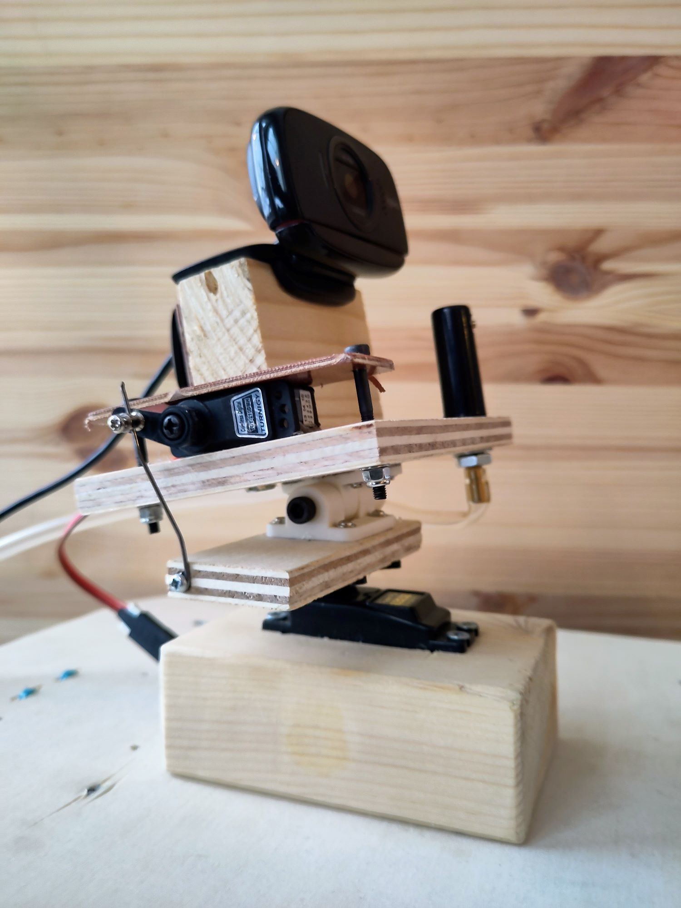
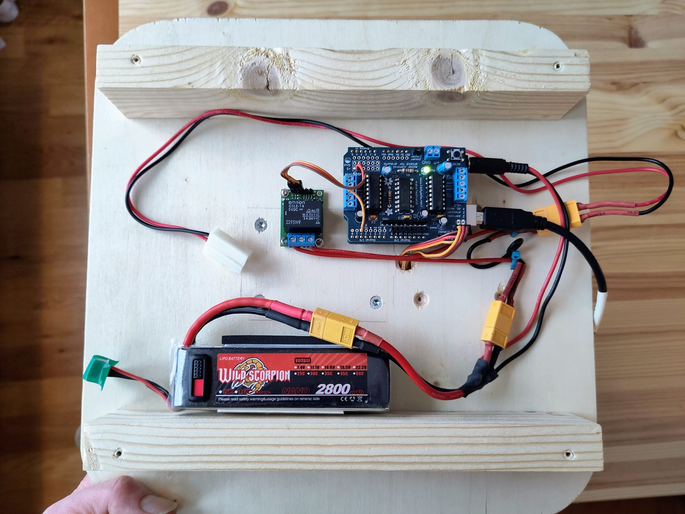
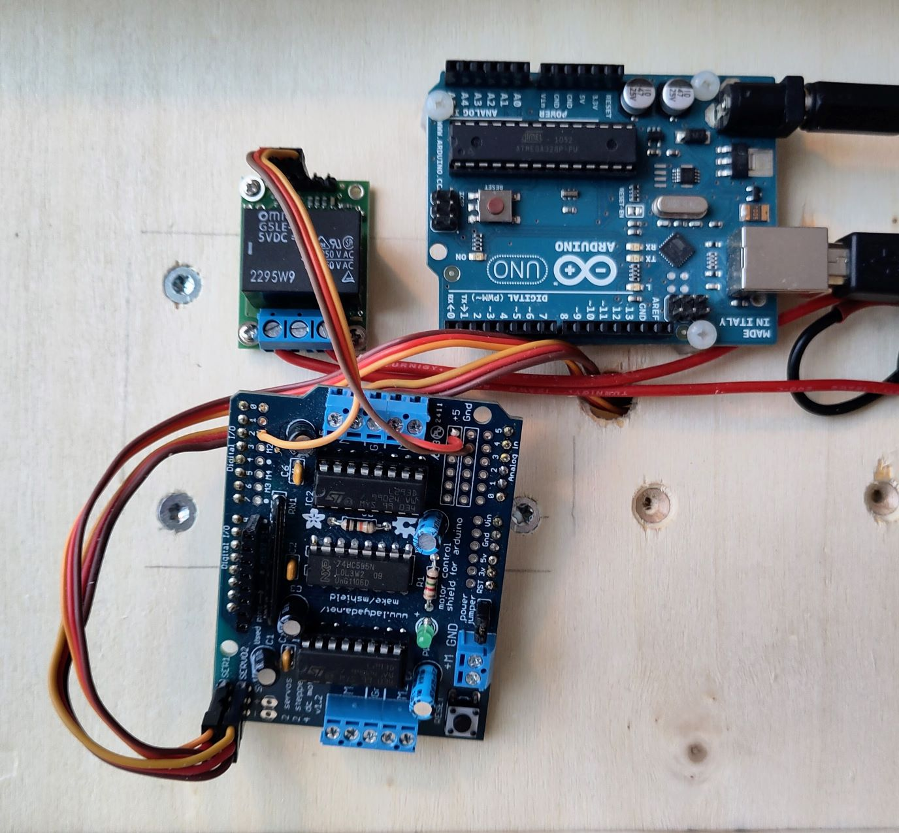

# face-tracking-water-gun
Arduino and Python code for a face tracking water gun, made from a webcam on a pan-tilt platform and a windshield wiper pump. Faces are detected using Haar cascades in OpenCV, and servos are controlled via an Arduino.

## Components
This project was originally built in 2019, with parts that were purchased before that. Some parts are not available any longer, or have been replaced with new versions. However, here is a list of the components used:

- **Camera**: Logitech HD 720P C525 webcam
- **Pan servo**: Tower Pro, SG-5010 
- **Tilt servo**: Turnigy TGY-210DMH
- **Relay**: [Pololu RC switch with relay](https://www.pololu.com/product/2804)
- **Microcontroller**: [Arduino Uno](https://en.wikipedia.org/wiki/Arduino_Uno) with [Adafruit Motor Shield v1](https://learn.adafruit.com/adafruit-motor-shield/overview)
- **Pump, hose, nozzle, and liquid container**: [Biltema 58-657](https://www.biltema.no/bil---mc/bildeler/viskerutstyr/vindusspyler/vindusspyler-15-l-2000017961)
 

## Face detection
